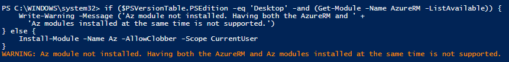
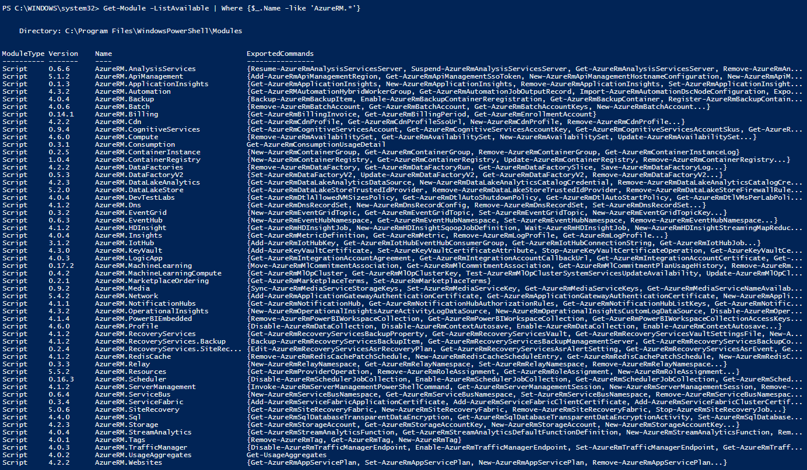

Installing the `Az` module on a machine that already contains `AzureRm` is not supported. 



We should remove `AzureRm` by executing the following commands:

```powershell
uninstall-module Azure
uninstall-module AzureRM
```

Then we should check if any modules remain by using the following command:

```powershell
Get-Module -ListAvailable | Where {$_.Name -like 'AzureRM.*'}
```

This will probably give a result like this:



Remove all the remaining modules for `AzureRM` by using the following command:

```powershell
$Modules = Get-Module -ListAvailable | Where {$_.Name -like 'AzureRM.*'}
Foreach ($Module in $Modules) {Uninstall-Module $Module}
```

Now we can try installing the `Az` module again:

```powershell
if ($PSVersionTable.PSEdition -eq 'Desktop' -and (Get-Module -Name AzureRM -ListAvailable)) {
    Write-Warning -Message ('Az module not installed. Having both the AzureRM and ' +
      'Az modules installed at the same time is not supported.')
} else {
    Install-Module -Name Az -AllowClobber -Scope CurrentUser
}
```
